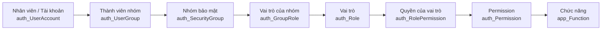
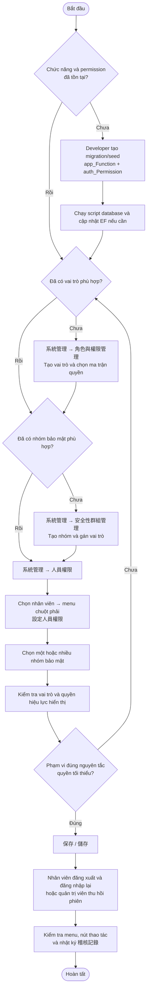
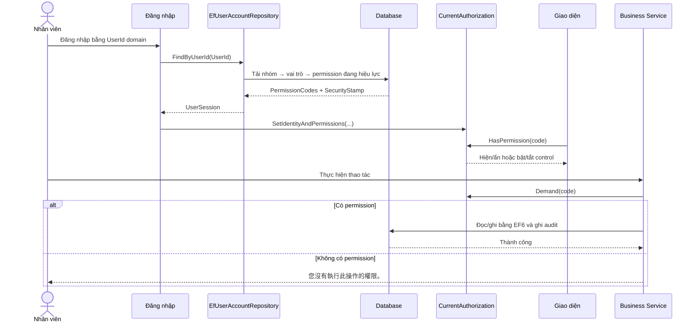

# Hướng dẫn cấu hình chức năng và quyền hạn cho nhân viên

| Thuộc tính | Giá trị |
|---|---|
| Module | `系統管理` |
| Phạm vi | Chức năng, permission, vai trò, nhóm bảo mật và quyền hiệu lực của nhân viên |
| Đối tượng | Quản trị viên hệ thống, developer và người kiểm thử |
| Cập nhật | 24/09/2026 |

## 1. Mục đích và phạm vi

Tài liệu này mô tả cách cấp quyền cho từng nhân viên trong `Winform4System`, từ lúc khai báo chức năng đến khi quyền được áp dụng trong phiên đăng nhập. Đối tượng sử dụng là quản trị viên hệ thống, người triển khai chức năng và người kiểm tra phân quyền.

Nguyên tắc cốt lõi:

> Không gán permission trực tiếp cho nhân viên. Nhân viên nhận quyền thông qua **nhóm bảo mật** và **vai trò**.

Mô hình này giúp quyền có thể tái sử dụng, kiểm toán được và tránh cấu hình khác nhau tùy tiện giữa các nhân viên có cùng nhiệm vụ.

## 2. Mô hình phân quyền



| Thành phần | Ý nghĩa | Ví dụ |
|---|---|---|
| Nhân viên/tài khoản | Người đăng nhập, dùng `UserId` dạng `VNW` + 7 chữ số | `VNW0014732` |
| Nhóm bảo mật | Tập hợp nhân viên có cùng phạm vi công việc | `SYSTEM_ADMINISTRATORS`, `STANDARD_USERS` |
| Vai trò | Gói trách nhiệm nghiệp vụ có thể dùng cho nhiều nhóm | `SECURITY_ADMIN`, `SPARE_PART_VIEWER` |
| Permission | Một hành động cụ thể trên một chức năng | `SYSTEM.USER.VIEW` |
| Chức năng | Module hoặc màn hình được quản lý | `SYSTEM.USER`, `ASSET.SPARE_PART` |

Quyền hiệu lực của một nhân viên là **hợp (union)** của permission từ tất cả nhóm đang có hiệu lực. Hệ thống hiện không dùng `DENY`; không có permission tương ứng nghĩa là bị từ chối.

## 3. Ý nghĩa các hành động permission

Permission có cấu trúc khuyến nghị:

```text
<FUNCTION_CODE>.<ACTION>
```

Ví dụ: `SYSTEM.USER.VIEW`, `SYSTEM.USER.ADMIN`, `ASSET.SPARE_PART.EXPORT`.

| Action | Mục đích |
|---|---|
| `ACCESS` | Cho phép vào khu vực hoặc module cấp cao |
| `VIEW` | Xem danh sách và chi tiết |
| `CREATE` | Tạo dữ liệu mới |
| `UPDATE` | Sửa dữ liệu |
| `DELETE` | Xóa hoặc ngừng sử dụng theo nghiệp vụ |
| `APPROVE` | Duyệt/xác nhận nghiệp vụ |
| `EXPORT` | Xuất dữ liệu hoặc báo cáo |
| `ADMIN` | Quản trị toàn bộ phạm vi do module đó định nghĩa |

Lưu ý: `ADMIN` không mặc nhiên thay thế mọi action trong toàn hệ thống. Hiện chỉ `ASSET.SPARE_PART.ADMIN` được code dùng như quyền bao phủ các action thuộc `ASSET.SPARE_PART.*`. Với các module khác, phải cấp rõ `VIEW`, `ADMIN` hoặc action mà Business Service đang kiểm tra.

## 4. Lưu đồ cấu hình quyền cho nhân viên



## 5. Quy trình thao tác chuẩn trên giao diện

### Bước 1 — Chuẩn bị chức năng và permission

Màn hình `功能卡管理` chỉ sửa thông tin của chức năng đã tồn tại như tên hiển thị, chức năng cha, thứ tự, trạng thái phát triển, `IsVisible` và `IsActive`. Màn hình này không tạo permission mới.

Khi phát triển một chức năng mới, developer phải tạo script trong `Database/Scripts` để:

1. Thêm hoặc cập nhật `app_Function` bằng mã chức năng ổn định.
2. Thêm các permission cần thiết vào `auth_Permission`.
3. Liên kết permission với đúng `FunctionId` và `ActionCode`.
4. Cập nhật entity/mapping EF6 nếu schema thay đổi.

Sau khi script được chạy, permission mới sẽ xuất hiện trong ma trận của `角色與權限管理`.

### Bước 2 — Tạo vai trò và chọn quyền

Đi tới:

```text
系統管理 → 角色與權限管理
```

Thao tác:

1. Chọn `新增角色` để tạo vai trò mới, hoặc nhấp chuột phải vào vai trò và chọn `編輯角色與權限`.
2. Đặt mã vai trò bằng chữ hoa, số và dấu gạch dưới, ví dụ `WAREHOUSE_OPERATOR`.
3. Đặt tên, mô tả rõ trách nhiệm nghiệp vụ.
4. Chọn permission trong ma trận **chức năng × hành động**.
5. Xem danh sách nhóm và nhân viên bị ảnh hưởng trước khi lưu.
6. Xác nhận thay đổi.

Khuyến nghị mỗi vai trò chỉ đại diện cho một trách nhiệm rõ ràng. Không tạo vai trò kiểu “quyền của anh A” hoặc gộp các nghiệp vụ không liên quan.

### Bước 3 — Tạo nhóm bảo mật và gán vai trò

Đi tới:

```text
系統管理 → 安全性群組管理
```

Thao tác:

1. Chọn `新增群組`, hoặc nhấp chuột phải vào nhóm và chọn `編輯群組`.
2. Đặt mã nhóm thể hiện phạm vi tổ chức hoặc công việc, ví dụ `WAREHOUSE_OPERATORS`.
3. Chọn một hoặc nhiều vai trò cho nhóm.
4. Kiểm tra danh sách nhân viên hiện đang thuộc nhóm.
5. Xác nhận và lưu.

Một nhóm có thể nhận nhiều vai trò. Một vai trò cũng có thể được dùng bởi nhiều nhóm.

### Bước 4 — Gán nhóm cho nhân viên

Đi tới:

```text
系統管理 → 人員權限
```

Thao tác:

1. Tìm nhân viên theo `UserId`, tên hoặc phòng ban.
2. Nhấp chuột phải đúng dòng nhân viên.
3. Chọn `設定人員權限`.
4. Đánh dấu các nhóm bảo mật cần gán.
5. Kiểm tra hai vùng xem trước:
   - Vai trò hiệu lực.
   - Permission hiệu lực.
6. Chọn `儲存` và xác nhận thay đổi.

Service sẽ kiểm tra lại permission `SYSTEM.USER.PERMISSION.ADMIN`, tính hợp lệ của nhóm, xung đột cập nhật và quy tắc không được loại bỏ quản trị viên cuối cùng.

### Bước 5 — Áp dụng và xác minh

Permission được nạp vào `CurrentAuthorization` khi đăng nhập. Vì vậy nhân viên phải đăng xuất rồi đăng nhập lại để nhận bộ quyền mới.

Nếu cần buộc phiên hiện tại kết thúc, quản trị viên vào `人員管理`, nhấp chuột phải vào nhân viên và chọn `撤銷登入工作階段`. `SecurityStamp` thay đổi sẽ làm phiên cũ mất hiệu lực trong chu kỳ kiểm tra phiên của ứng dụng.

Sau khi đăng nhập lại, kiểm tra:

- Card chức năng có xuất hiện hay không.
- Tab/menu con có xuất hiện hay không.
- Nút thêm mới, xuất hoặc thao tác dòng có đúng trạng thái không.
- Business Service có từ chối thao tác không được phép hay không.
- `稽核記錄` có ghi nhận thay đổi quyền hay không.

## 6. Luồng kiểm tra quyền khi chạy ứng dụng



UI kiểm tra permission để tạo trải nghiệm đúng, nhưng đó không phải lớp bảo vệ duy nhất. Mọi thao tác thay đổi dữ liệu vẫn phải gọi `CurrentAuthorization.Demand(...)` tại Business Service.

## 7. Điều kiện để một quyền có hiệu lực

Một permission chỉ nên được coi là hiệu lực khi toàn bộ chuỗi sau hợp lệ:

1. Tài khoản đang hoạt động và không bị khóa.
2. Quan hệ nhân viên–nhóm có `IsActive = 1`.
3. `ExpiresAt` của quan hệ nhóm chưa hết hạn hoặc để trống.
4. Nhóm bảo mật đang hoạt động.
5. Quan hệ nhóm–vai trò đang hoạt động.
6. Vai trò đang hoạt động.
7. Quan hệ vai trò–permission đang hoạt động.
8. Permission đang hoạt động.
9. Chức năng đang hoạt động; để hiện card chính, chức năng và chức năng cha còn phải được đặt `IsVisible = 1`.
10. Nhân viên đã đăng nhập lại sau lần thay đổi gần nhất.

Card trên trang chính được lọc theo function mà người dùng có ít nhất một permission. Tuy nhiên một số module còn kiểm tra permission cụ thể như `VIEW` hoặc `SYSTEM.SETTINGS.VIEW` trước khi mở. Vì vậy “thấy card” không đồng nghĩa với “được thực hiện mọi thao tác”.

## 8. Ví dụ cấu hình

### Ví dụ A — Nhân viên chỉ được xem phụ tùng

```text
Nhân viên VNWxxxxxxx
  → Nhóm SPARE_PART_VIEWERS
    → Vai trò SPARE_PART_VIEWER
      → ASSET.SPARE_PART.VIEW
```

Kết quả: nhân viên thấy module phụ tùng và xem dữ liệu, nhưng không được thêm, sửa, xóa, duyệt hoặc xuất nếu thiếu các permission tương ứng.

### Ví dụ B — Người quản lý nhân viên

```text
Nhân viên VNWxxxxxxx
  → Nhóm HR_USER_ADMINISTRATORS
    → Vai trò HR_USER_ADMIN
      → SYSTEM.ACCESS
      → SYSTEM.SETTINGS.VIEW
      → SYSTEM.USER.VIEW
      → SYSTEM.USER.ADMIN
```

Kết quả: nhân viên vào được khu vực hệ thống, thấy màn hình nhân viên và thực hiện các thao tác quản lý tài khoản. Không cấp `SYSTEM.ROLE.ADMIN` hoặc `SYSTEM.GROUP.ADMIN` nếu người này không chịu trách nhiệm quản trị phân quyền.

### Ví dụ C — Quản trị viên phân quyền

Nhóm hệ thống `SYSTEM_ADMINISTRATORS` nhận vai trò `SECURITY_ADMIN`. Vai trò này phải giữ các quyền lõi quản trị bảo mật; service sẽ từ chối lưu nếu loại bỏ các quyền bắt buộc. Hệ thống cũng không cho loại bỏ thành viên quản trị cuối cùng còn hiệu lực.

## 9. Kiểm tra và xử lý sự cố

| Hiện tượng | Điểm cần kiểm tra |
|---|---|
| Không thấy card chức năng | Function/cha có active và visible; người dùng có permission gắn với function; đã đăng nhập lại |
| Thấy card nhưng không mở được | Thiếu permission cụ thể mà `MainForm` hoặc module yêu cầu, thường là `VIEW` |
| Xem được nhưng không sửa được | Thiếu `ADMIN`, `UPDATE` hoặc permission mà service tương ứng dùng |
| Đã gán nhóm nhưng quyền không đổi | Nhân viên chưa đăng nhập lại; nhóm/vai trò/mapping bị ngừng; membership hết hạn |
| Ma trận không có ô để chọn | Chưa có bản ghi `auth_Permission` cho function và action đó |
| Không thể bỏ nhóm quản trị | Người đó là quản trị viên hiệu lực cuối cùng |
| Không thể ngừng vai trò/nhóm hệ thống | Vai trò còn được gán cho nhóm hoặc nhóm còn thành viên |

Có thể dùng view chỉ đọc sau để đối chiếu quyền hiệu lực trong database:

```sql
SELECT UserId, GroupCode, RoleCode, PermissionCode, FunctionCode, ActionCode
FROM dbo.vw_auth_UserEffectivePermission
WHERE UserId = 'VNW0014732'
ORDER BY FunctionCode, ActionCode, GroupCode, RoleCode;
```

Không sửa trực tiếp các bảng phân quyền để xử lý sự cố. Thay đổi thường ngày phải đi qua giao diện để bảo đảm validation, concurrency check và audit được thực hiện đầy đủ.

## 10. Checklist nghiệm thu

- [ ] Mã chức năng và permission đã được tạo bằng migration/seed.
- [ ] Vai trò có tên, mô tả và phạm vi nghiệp vụ rõ ràng.
- [ ] Vai trò chỉ chứa các permission tối thiểu cần thiết.
- [ ] Nhóm bảo mật được đặt theo phạm vi tổ chức hoặc công việc.
- [ ] Nhân viên được gán vào nhóm, không được gán permission trực tiếp.
- [ ] Đã xem danh sách nhóm/người bị ảnh hưởng trước khi thay đổi vai trò.
- [ ] Đã xác nhận không làm mất quản trị viên cuối cùng.
- [ ] Nhân viên đã đăng nhập lại hoặc phiên cũ đã được thu hồi.
- [ ] Đã kiểm tra cả giao diện và hành vi Business Service.
- [ ] Thay đổi xuất hiện trong `稽核記錄`.

## 11. Bảng ánh xạ kỹ thuật nhanh

| Nhu cầu | Giao diện | Permission quản trị cần có | Business Service |
|---|---|---|---|
| Xem/gán nhóm cho nhân viên | `人員權限` | `SYSTEM.USER.PERMISSION.VIEW/ADMIN` | `EmployeePermissionService` |
| Tạo nhóm và gán vai trò | `安全性群組管理` | `SYSTEM.GROUP.VIEW/ADMIN` | `SecurityGroupManagementService` |
| Tạo vai trò và gán permission | `角色與權限管理` | `SYSTEM.ROLE.VIEW/ADMIN` | `RolePermissionManagementService` |
| Sửa metadata/card chức năng | `功能卡管理` | `SYSTEM.FUNCTION.VIEW/ADMIN` | `ApplicationFunctionService` |
| Xem lịch sử thay đổi | `稽核記錄` | `SYSTEM.AUDIT.VIEW` | `AuditLogService` |

Các bảng nối `auth_UserGroup`, `auth_GroupRole` và `auth_RolePermission` sử dụng trạng thái active thay vì xóa vật lý trong luồng quản trị. Điều này giữ được lịch sử quan hệ và cho phép audit thay đổi một cách rõ ràng.
